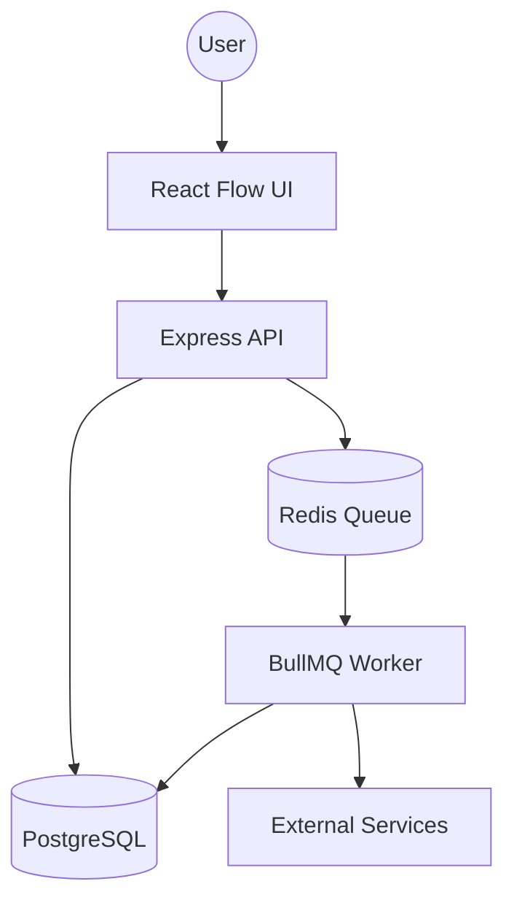

# ⚡ FlowForge - Workflow Automation Engine

A high-performance, backend-centric workflow automation engine similar to n8n and Zapier. Designed for modularity, scalability, and robust system architecture.

[](https://www.gnu.org/licenses/gpl-3.0)
[](https://www.typescriptlang.org/)
[](https://reactjs.org/)
[](https://www.postgresql.org/)
[](https://redis.io/)

---

## 🚀 Engineering Showcase

FlowForge is not just a UI; it's a demonstration of modern backend engineering patterns:

- **Monorepo Architecture**: Efficient project management using Turborepo and pnpm workspaces.
- **Asynchronous Processing**: Decoupled task execution using **BullMQ** and **Redis** for state-of-the-art job handling.
- **ORM & Type Safety**: Full end-to-end type safety with **Prisma** and TypeScript.
- **Graph Traversal Logic**: Custom engine design for processing workflow Directed Acyclic Graphs (DAGs).
- **Scalability**: Separate API and Worker services, allowing independent scaling of the engine and the interface.

---

## ✨ Features

- **Node-Based Editor**: Drag-and-drop workflow builder powered by **React Flow**.
- **Real-time Execution**: Watch workers process your workflows step-by-step.
- **Execution History**: Deep-dive audit logs for every workflow run.
- **Modular Node System**: Easily extendable architecture for Webhooks, HTTP Requests, Emails, and more.
- **Dark-Themed UI**: Modern, high-premium aesthetic design for technical users.

---

## ⚠️ Status: Test & Demo

This project is currently a **Technical Demo**. It is designed to showcase system architecture and core workflow logic. While functional, it serves as a foundation for further development rather than a production-ready tool.

### 🧪 Future Development & Contributions

You are encouraged to fork this repository and extend its capabilities! Some suggested areas for improvement:
- **Authentication**: Implement JWT-based user sessions and repository access.
- **New Node Handlers**: Add real integrations for Slack, Discord, OpenAI, or Google Sheets.
- **Dynamic Webhooks**: Generate unique URLs for each webhook trigger.
- **Cron Triggers**: Implement scheduled workflow executions.

Feel free to submit Pull Requests or open Issues for new feature ideas!

---

## 🔑 Configuration & API Keys

The application uses environment variables for configuration. API keys and sensitive data should be placed in a `.env` file in the root directory.

1. Copy the example file:
   ```bash
   cp .env.example .env
   ```
2. Edit `.env` and add your keys:
   - `DATABASE_URL`: Your PostgreSQL connection string.
   - `REDIS_HOST / REDIS_PORT`: Your Redis connection details.
   - **External Keys**: As you add new nodes (e.g., SendGrid, OpenAI), add their respective keys here.

---

## 🛠️ Tech Stack

| Layer | Technology |
|---|---|
| **Core** | TypeScript, Node.js |
| **Frontend** | React, Vite, React Flow, TailwindCSS |
| **Backend** | Express.js |
| **Database** | PostgreSQL + Prisma ORM |
| **Messaging** | Redis + BullMQ |
| **Build System** | Turborepo, pnpm |

---

## 📖 Architecture



---

## 📄 License

This project is licensed under the **GNU General Public License v3.0**. See the [LICENSE](LICENSE) file for details.

---

**Crafted with engineering excellence to power your automation.**
